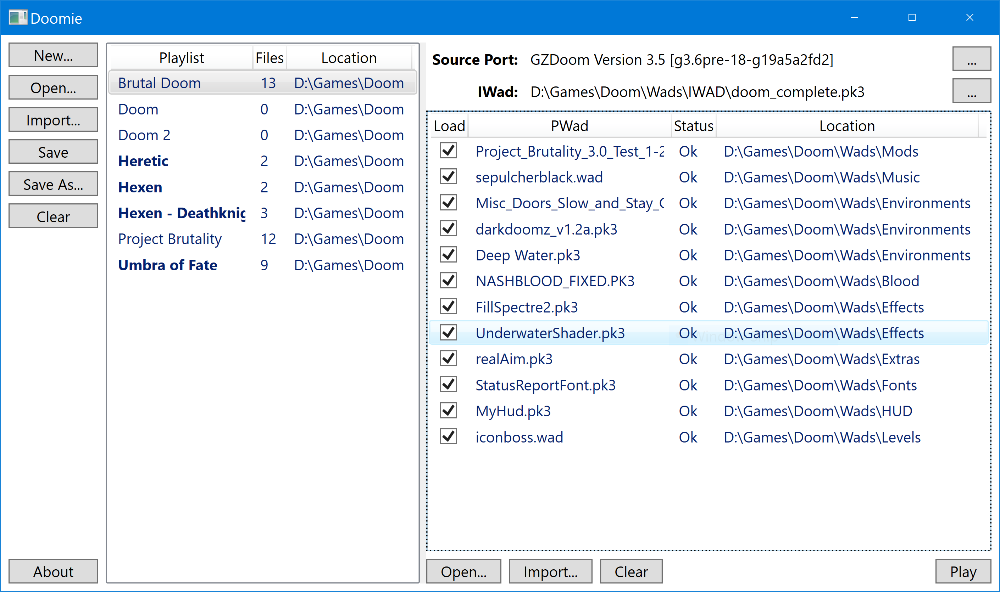

# Doomie

**About:**
A simple id Tech 1 Windows frontend launcher written in C# and XAML using the .net framework. The aim was to be able to easily mix different WAD files and play Doom :)

**Notes:**
- NO LONGER UNDER ACTIVE DEVELOPMENT
- This repository is a copy of the original thread available at [https://forum.zdoom.org/viewtopic.php?f=44&t=61647](https://forum.zdoom.org/viewtopic.php?f=44&t=61647), the aim is to move the source files into a version controlled repository instead of having the files on a file download host. Everyone is free to clone and download the source files.
- You can name your IWads as you please, to do so create a file "Names.map" or use the one available for download, in the root folder where the app is. You can use HashCheck Shell Extension (Open-Source) to calculate MD5 hashes, available here: [http://code.kliu.org/hashcheck/](http://code.kliu.org/hashcheck/) the data format to be used is HASH=NAME.
- Playlists shows a custom icon if a .PNG file named after the Playlist exists where the Playlist file is located.

**Screenshot:**

**Compiled binaries available here (needs dot net version > 4.5):**
<a href="https://www.mediafire.com/folder/00yyb8cxtdbu4/Doomie">https://www.mediafire.com/folder/00yyb8cxtdbu4/Doomie</a>

**History:**
Hi everyone, I've been away from Doom world for a couple of months now (1 year?!), unfortunately my computer video card burned, was forced to move to Mac land and now back on to Linux, no longer using Windoes :) Anyways, as my previous machine died on me and as I'm not planning on working on Doomie anymore, I might as well release it on to the community in case someone wants to further expand and develop Doomie... please bear in mind the code *cough* might be considered *cough* "spaghetti" code... but hey it worked *cough* compiled *cough* (MVC code I'm looking at you)... anyways long story short: I'm not planning on further developing Doomie past version 1.7 so I'm releasing here the sources for anyone who want to mess with it... IMPORTANT: It is required for you to abide to a few things before you decide to move the buttons on the UI from the left side of the screen to the right side and claim you've developed a brand new launcher, these are:
1. THOU SHALL NOT USE THE NAME DOOMIE OR SIMILAR (EXAMPLE: DOOMIE-NG) TO NAME YOUR PROJECT,
2. THOU SHALL GIVE CREDIT WHERE CREDIT IS DUE AND INCLUDE A REFERENCE TO THE ORIGINAL DOOMIE NAME, ORIGINAL DOOMIE URL FOR DOWNLOAD, ANY DOOMIE DLL FILES USED FOR SUPPORT, ANY DOOMIE CONTRIBUTORS & DOOMIE DEVELOPER AUTHOR ON YOUR DERIVATIVE VERSION,
3. THOU SHALL RELEASE YOU VERSION UNDER A FREEWARE OR GPL LICENSE... 
That is all folks! Sheppard out!

**Usage instructions:**
1. Launch "Doomie.exe"
2. Create a Playlist wherever you want or select one available ("Open" or "Import" Playlists from somewhere else)
** Do make sure one Playlist is selected **
3. Use the "..." buttons to select the SourcePort & IWad
4. (Optional if you don't need any PWads) Using "Open" (selects one file) or "Import" (imports all *.wad, *.deh, *.pk7, ... files from the any directory) buttons add any PWads you wish to the Playlist
5. Click "Play" button

Note: Each playlist can be saved anywhere you wish and each can point to a different source port & IWad located anywhere you wish. Playlists, SourcePorts & Wads folders are part of the distribution zip file, but you don't have to use them, you can delete or ignore them, as a matter of fact the only needed files are: "Doomie.exe", "GongSolutions.Wpf.DragDrop.dll" and "Playlist.png"; "Doomie.cfg" will be created if not exists when first run. Once you specify a Sourceport, IWad or PWad the app will remember the last used folder -- this is valid for each Open and Import button on the UI.

**Version log:**
Version 1.7 (03/09/2018)
- Implemented filter functionality over Playlists and PWads lists.
- UI clean-up.
- If "Playlist.png" file exists will be used as default Playlist icon where an icon for the Playlist name does not exist.
- "Names.map" file is no longer part of the main downloaded archive and is now a separate download file so it can be updated separately.

*Version 1.6 (02/09/2018)*
- Icon added, thank you NightFright.
- "Names.map" updated as per NightFright's contributions.
- Playlists shows a custom icon if a .PNG file named after the Playlist exists where the Playlist file is located.
- Columns resize automatically according to biggest row length.
- Remembers window Splitter position.
- Remembers Window position on screen.
- Removed support for Playlists drag and drop.
- Allows reordering of Playlists.

*Version 1.5 (30/08/2018) One day ahead of schedule*
- File "Names.map" if exists will be looked at to map IWads names.
- Added support to load PK7 files.
- Corrected an issue where un-maximizing the window would not use the previous window width.

*Version 1.4 (26/08/2018)*
- Fixed a bug where "Save As" functionality if saving over an existing Playlist would crash.
- Fixed a bug where "Remove playlist(s)" was calling the save playlist functionality also for playlists other than the selected one(s).
- List of loaded Playlists persists through sessions.
- Reworked the "About" dialog a little bit.
- Added Playlist "Location" on to the "Save changes" dialog.
- Removed command line parameters functionality.
- Added identification for a few more stand-alone IWads.
- Doomie settings are now saved in "Doomie.cfg" file instead of "Settings.ini".
- Saves last "Import" and "Load" location used for Playlists, Sourceport, IWAD and WAD files separately in "Doomie.cfg" file.

*Version 1.3.1 (24/08/2018)*
- Fixed a bug when using directories with spaces was not passing paths with spaces to the Sourceport correctly.
- A "Not found" message is displayed when the IWad or Sourceport used is missing.

*Version 1.3 (23/08/2018)*
- Implemented support for arguments per Sourceport.
- Saves the window size in "Settings.ini" file (this file is saved where the application is located). (Changed to "Doomie.cfg" in later versions)

*Version 1.2 (19/08/2018)*
- Added Sourceport parameter parsing ability at the command line. (Removed in later versions)
- Importing PWAD files already in Playlist keeps existing PWAD with it's flag settings.
- Prompts for saving Playlist changes on "Remove" or "Clear" if any.

*Version 1.1 (14/08/2018)*
- Fixed a bug while importing PWAD files, if extension was different than lower-case would not import the files.
- Implemented support for Sourceport's "-merge" argument.
- Added support to load DEH and BEX files.
- Reworked the "About" dialog.

*Version 1.0 (12/08/2018)*
- Initial release.

**Features:**
- Easy to use
- Resolution independent UI
- You can add your own names to each IWad
- Works with any Source Port
- No configuration options
- Portable between machines (Windows only)
- Free

**Platform:**
- Windows

**Dependencies:**
- Requires dot net version > 4.5 to be installed, you can get it here: [https://www.microsoft.com/en-us/download/details.aspx?id=30653](https://www.microsoft.com/en-us/download/details.aspx?id=30653)
- Requires GongSolutions.Wpf.DragDrop.dll (included in the download archive)
